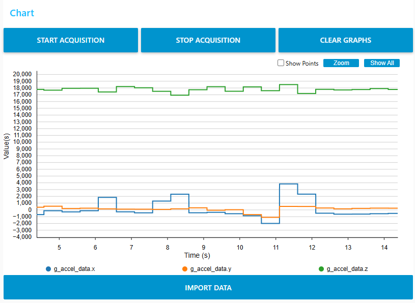
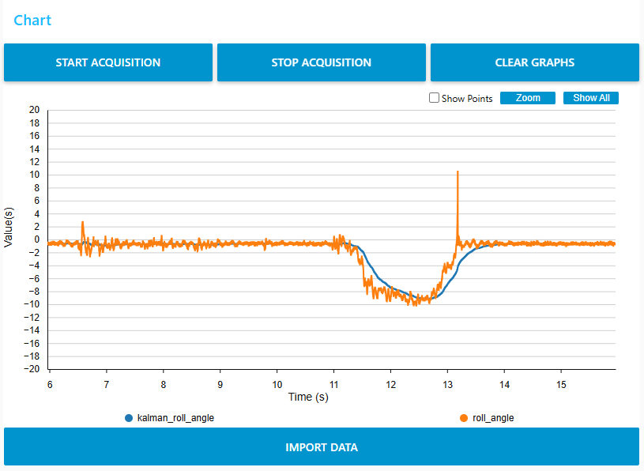

# stm32f07xx_MPU6500_PWM_LED_Controller

This project uses an MPU6500 6 axis accelerometer/gyroscope module to detect tilt angles and generate PWM signals to light up a corresponding LED with varying brightness. It uses FreeRTOS tasks to handle retrieving the
MPU6500 data and process it. The raw data is very noisy so a Kalman filter is applied to clean it up and make it usable. It uses the timer peripherals of the MCU to generate the PWM signals.

# Implementation
The project was written with the STM32F407xx CubeMX HAL library. The driver and user application code utilizes these HAL libraries primarily for communincation and configuration of the peripherals such as the hardware timers.
The project also uses FreeRTOS for task management and separation of responsibilities among those tasks.

# Documentation

Chart displaying the x y and z axis data retrieved from the MPU6500

Chart displaying the roll angle data retrieved from the MPU6500, both with and without the kalman filtering. The orange line shows the raw data and the blue line is the data after the kalman filtering.

Charts generated in STM32CubeMonitor software

# Background
I did this project to get more experience with FreeRTOS and interfacing with external peripherals and using the data they provide. I also wanted to practice filtering data to turn the raw data into something that is more useful.

# Known Issues
The MPU6500 in interrupt mode can send so many interrupts that the MCU will get stuck in the IRQ handler indefinitely.

# ***TODO***

